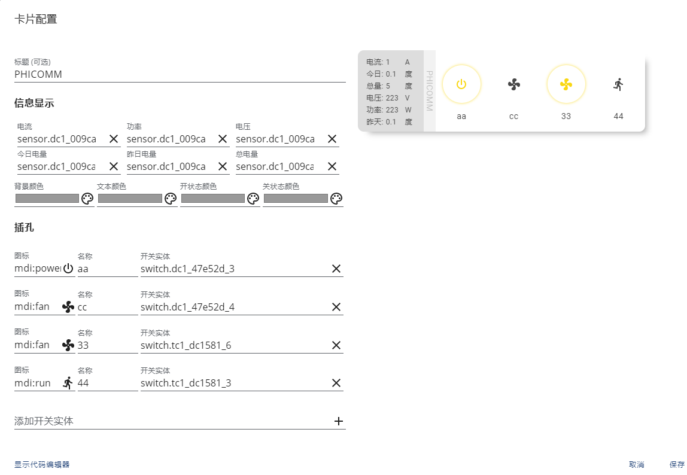

<!--
 * @Author        : fineemb
 * @Github        : https://github.com/fineemb
 * @Description   : 
 * @Date          : 2020-02-16 22:33:53
 * @LastEditors   : fineemb
 * @LastEditTime  : 2020-08-26 15:37:52
 -->

# Lovelace DC1 Card

[](https://github.com/custom-components/hacs)

斐讯DC1排插卡片,这只是一个Lovelace的前端卡片, 具体硬件部分可以看[罗总的固件](https://github.com/qlwz/esp_dc1).

+ 卡片可以定义多个传感器,显示排插的相关数据
+ 4个switch开关, 3个是插座,还有一个是USB, 可自由排序
## 更新
v 1.2.0
+ 优化代码,修复一些小bug
+ 增加前端UI的卡片配置

v 1.1.3 
+ 适配hass 0.110.0 修复图标不显示的问题
+ 排插按钮不固定4个,可任意设置, 但是建议还是4个比较美观
## 预览



## HACS 安装
搜索DC1, 或者手动添加地址安装
## 手动安装
1. 下载 `dc1-card.js`
1. 复制到 `www\community\lovelace-dc1-card`
1. 在Lovelace的resources下添加以下配置
    ``` yaml
    resources:
      - url: /local/community/lovelace-dc1-card/dc1-card.js
        type: js
    ```
1. 在Lovelace视图 `views.cards` 内部添加卡片配置
    ```yaml
    type: custom:dc1-card
    name: 工作间
    background_color: var(--paper-card-background-color)
    title_color: var(--icon-color-off)
    on_color: var(--paper-item-icon-active-color)
    off_color: var(--icon-color-off)
    sensors:
      a: sensor.dianliu
      w: sensor.gonglv
      v: sensor.dianya
      today: sensor.jintian
      yesterday: sensor.zuotian
      total: sensor.zong
    entitys: 
      - entity: switch.dc1_487F56_1
        title: USB
        icon: mdi:usb-port
      - entity: switch.dc1_487F56_2
        title: 吹风机
        icon: mdi:hair-dryer
      - entity: switch.dc1_487F56_3
        title: 台灯
        icon: mdi:desk-lamp
      - entity: switch.dc1_487F56_4
        title: 电脑
        icon: mdi:desktop-classic
    ```
    把`sensor` `switch`还有`title`替换成自己的相关实体

## 选项

| 属性名 | 类型 | 默认 | 描述
| ---- | ---- | ------- | -----------
| name | string | 选项 | 这是整个排插的名字,~~现在还没想好UI部分放哪里~~
| a | entity id | 选项 | 这里配置电流传感器
| w | entity id | 选项 | 这里配置功率传感器
| v | entity id | 选项 | 这里配置电压传感器
| today | entity id | 选项 | 这里配置今日电量传感器
| yesterday | entity id | 选项 | 这里配置昨天用电量传感器
| total | entity id | 选项 | 这里配置总计电量传感器
| entity | entity id | **必选** | 这个配置开关实体,总共必须配置4个
| title | string | 选项 | 对应开关实体下的名称,如果不配置将读取实体的默认名称,建议配置
| icon | string | 选项 | 对应开关实体下的图标,如果不配置将读取实体的默认图标,建议配置
| background_color | string | 选项 | 卡片背景颜色,默认不需要配置跟随主题--paper-card-background-color
| title_color | string | 选项 | 卡片文本颜色,默认不需要配置跟随主题--icon-color-off
| on_color | string | 选项 | 打开状态颜色,默认不需要配置跟随主题--paper-item-icon-active-color
| off_color | string | 选项 | 关闭状态颜色,默认不需要配置跟随主题--icon-color-off

**确保所有传感器和开关是有效配置后才能正确显示**


